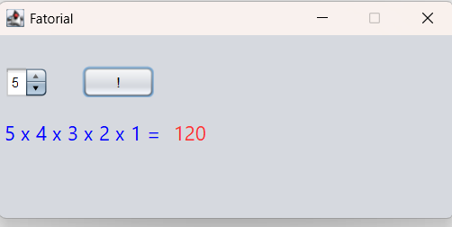

# Funcao01

Aplicação Java Swing desenvolvida para demonstrar o uso de funções e interação com interface gráfica.

## Tecnologias utilizadas

- Java 21
- Swing
- Maven
- NetBeans

## Tela do Aplicativo



## Como executar

Baixe o arquivo `.jar` disponível em Releases e execute:

```bash
java -jar Funcao01-1.0-SNAPSHOT.jar
